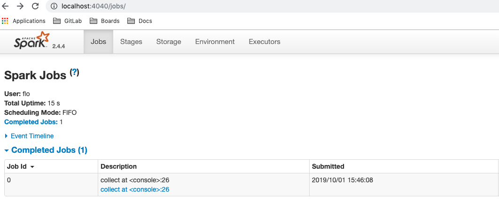
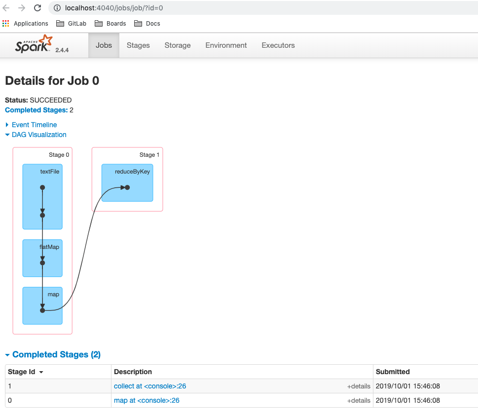
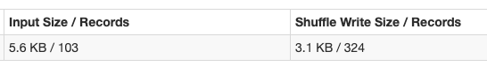
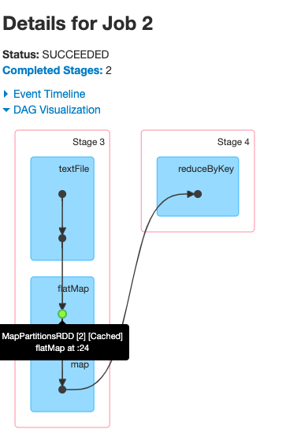
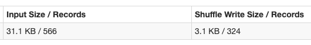

# TP 1 : Installation de Spark, Spark-shell, et word count

<!-- TOC -->

- [TP 1 : Installation de Spark, Spark-shell, et word count](#tp-1--installation-de-spark-spark-shell-et-word-count)
    - [Installation de Spark (Mac et Linux)](#installation-de-spark-mac-et-linux)
    - [Début du TP](#début-du-tp)
    - [Spark-shell tricks](#spark-shell-tricks)
        - [Autocomplétion](#autocomplétion)
        - [Les commandes magiques](#les-commandes-magiques)
    - [SparkContext vs SparkSession](#sparkcontext-vs-sparksession)
    - [Word count avec un RDD](#word-count-avec-un-rdd)
        - [Lire un fichier de données non structurées via un RDD](#lire-un-fichier-de-données-non-structurées-via-un-rdd)
        - [Word count](#word-count)
        - [Digression : types des variables](#digression--types-des-variables)
        - [Mots les plus fréquents](#mots-les-plus-fréquents)
    - [Word count avec un DataFrame](#word-count-avec-un-dataframe)
    - [Bonus : Persistance](#bonus--persistance)

<!-- /TOC -->

## Installation de Spark (Mac et Linux)

Suivre la section [Setup TP 1: (Mac et Linux) Installation de Spark](setup.md#setup-tp-1-mac-et-linux-installation-de-spark) du fichier [setup.md](setup.md).

## Début du TP

Pour ce premier TP, on utilisera uniquement le [spark-shell](https://spark.apache.org/docs/latest/quick-start.html#interactive-analysis-with-the-spark-shell), qui permet d'exécuter des commandes spark de façon interactive (à la [iPython](https://ipython.org/)).

Suivre la [doc](setup.md#utiliser-le-spark-shell) pour lancer le spark-shell et l’interface utilisateur dans un navigateur.

Je vous encourage vivement à utiliser les docs de [Spark](https://spark.apache.org/docs/latest/api/scala/index.html#package) et [Scala](https://www.scala-lang.org/api/current/index.html) dès que vous ne connaissez pas un objet, une fonction, que vous souhaitez connaître toutes les fonctions disponibles d'un objet, ou si vous êtes simplement bloqué. Vous pouvez également vous reporter au document [spark_notes.md](spark_notes.md) pour des ressources et quelques généralités sur Spark et sa documentation. Google est évidemment votre ami, et StackOverflow une source infinie de questions-réponses.

Enfin, la [doc de Spark](https://spark.apache.org/docs/latest/index.html) est vraiment bien faite. La partie *Programming Guides* sera probablement votre point d'entrée pour en apprendre plus sur chaque concept/module/librairie de Spark. La partie [Quick Start](https://spark.apache.org/docs/latest/quick-start.html) est une bonne entrée en matière.

## Spark-shell tricks

### Autocomplétion

Le shell spark dispose entre autres de l’autocomplétion, en appuyant sur la touche *tab*, applicable à différents niveaux :
- pour trouver le nom d'un objet (une variable, un objet, une classe, une fonction, etc.)
- pour afficher toutes les fonctions disponibles d'un objet
- pour afficher tous les prototypes d'une fonction

Tapez par exemple dans le spark-shell `sp` puis sur la touche *tab* : tous les objets disponibles dont le nom commence par *sp* s'affichent. Tapez `spark.` puis sur *tab* : toutes les fonctions disponibles à partir de l'objet *spark* s'affichent. Tapez `spark.createDataFrame` puis sur *tab* : tous les prototypes de la fonction *createDataFrame* de l'objet *spark* s'affichent.

**Digression** : un prototype d'une fonction correspond à la déclaration du nom de la fonction, du nom et du type de ses arguments, ainsi que du type de retour, mais sans le corps de la fonction. Par exemple :
```scala
def maFonction(x: Int, y: Double): Double
```
En scala on peut avoir plusieurs prototypes pour un même nom de fonction, ce qu'on appelle aussi l'overloading de fonctions.

### Les commandes magiques

Pour afficher toutes les commandes magiques du shell, tapez dans celui-ci :
```scala
scala> :help
```

Une commande particulièrement intéressante est `:paste` qui permet d'entrer en mode copier-coller : on peut ensuite copier-coller du code qui fait potentiellement plusieurs lignes et tout exécuter en appuyant ensuite sur *ctrl-D*.

NB : quand on copie-colle dans ce mode du code qui fait plusieurs lignes, on ne peut pas modifier le code des lignes précédentes. Le mieux dans ce cas est d'écrire le code dans un éditeur de texte puis de le copier-coller pour pouvoir le modifier facilement.

NB 2 : on n'est pas obligé de passer par ce mode pour copier-coller du code écrit sur une seule ligne.

ATTENTION : en appuyant sur *ctrl-C* vous killez le spark-shell. Sachant que le *C* est juste à côté du *D*, une mauvaise manip est vite arrivée (oui ça sent le vécu).

Si vous faites du copier-coller de plusieurs lignes sans passer par le *:paste*, vous allez avoir un comportement inattendu. Par exemple, copier-coller
```scala
val df = spark
  .createDataFrame(Seq(("jean", 10)))
  .toDF("name", "age")
```
sans passer par le *:paste* donne
```scala
scala> val df = spark
df: org.apache.spark.sql.SparkSession = org.apache.spark.sql.SparkSession@c8531b9

scala>   .createDataFrame(Seq(("jean", 10)))
<console>:1: error: illegal start of definition
  .createDataFrame(Seq(("jean", 10)))
  ^

scala>   .toDF("name", "age")
<console>:1: error: illegal start of definition
  .toDF("name", "age")
  ^

scala>
```
On remarque que Spark considère chaque ligne de notre expression comme une ligne à part entière qui n'est pas liée à la précédente, ce qui signifie pour le spark-shell que la première ligne a du sens mais pas les deux autres. Une erreur est donc levée pour les deux dernières lignes sous la forme `error: illegal start of definition`. Heureusement ce comportement n'est pas présent lorsqu'on exécute un fichier directement.

## SparkContext vs SparkSession

Avant la version 2.0 de Spark, le point d’entrée principal des fonctionnalités de Spark et en particulier des RDDs était le [*SparkContext*](https://spark.apache.org/docs/latest/api/scala/index.html#org.apache.spark.SparkContext). Depuis la version 2.0, c'est avant tout le [*SparkSession*](https://spark.apache.org/docs/latest/api/scala/index.html#org.apache.spark.sql.SparkSession), qui permet entre autres d'utiliser les DataFrames et Datasets.

Tout ce qui est faisable avec un SparkContext est faisable avec un SparkSession, l'inverse est faux. Le SparkContext reste accessible surtout pour des raisons de backward compatibility. A l'avenir, dans vos projets, privilégiez toujours le SparkSession.

## Word count avec un RDD

On veut travailler ici avec des RDDs qui sont la structure sous-jacente des DataFrames et Datasets. En principe vous utiliserez presque toujours des DataFrames pour vos projets Spark, mais il est intéressant d’avoir vu les RDDs non seulement pour comprendre comment fonctionne Spark avec les données mais aussi parce que vous trouverez peut-être en entreprise des projets Spark sur d’anciennes versions qui utilisent uniquement des RDDs.

### Lire un fichier de données non structurées via un RDD

Dans le spark-shell, un SparkContext est automatiquement créé pour vous et est accessible en tapant `sc`. Cet objet possède une fonction *textFile* qui permet de lire un fichier et de récupérer le résultat dans un RDD (lire la [doc de la fonction](https://spark.apache.org/docs/latest/api/scala/index.html#org.apache.spark.SparkContext@textFile(path:String,minPartitions:Int):org.apache.spark.rdd.RDD[String]) est toujours une bonne idée).

Chargez le fichier `README.md`, qui se trouve dans votre dossier Spark, dans un RDD (le chemin vers le fichier sera très probablement différent du mien, utilisez le bon) :
```scala
scala> val rdd = sc.textFile("/Users/flo/Documents/packages/spark-2.3.4-bin-hadoop2.7/README.md")
```

Affichez les 5 premières lignes du fichier :
```scala
scala> rdd.take(5).foreach(println)
# Apache Spark

Spark is a fast and general cluster computing system for Big Data. It provides
high-level APIs in Scala, Java, Python, and R, and an optimized engine that
supports general computation graphs for data analysis. It also supports a
```

**Explication** : la fonction *take* d'un RDD prend en paramètre le nombre d'éléments du RDD qu'on veut garder (les *n* premiers éléments) et renvoie un [*Array*](https://www.scala-lang.org/api/current/scala/Array.html), qui est une structure de données de base en Scala, contenant ces *n* éléments. Comme mentionné dans la doc, un Array possède la fonction *foreach* qui permet d'appliquer à chaque élément n'importe quelle fonction. On choisit ici d'utiliser la fonction *println* qui permet d'afficher une valeur dans le terminal (c'est l'équivalent du *print* en python). Les 5 lignes de l'output correspondent donc aux 5 premières lignes du fichier.

### Word count

Comptons désormais le nombre de mots dans le fichier et affichons les 10 premières lignes du résultat :
```scala
val wordCount = rdd
  .flatMap(line => line.split(" "))
  .map(word => (word, 1))
  .reduceByKey((i, j) => i + j)

wordCount.take(10).foreach(println)
```
Vous devriez obtenir quelque chose comme :
```
(package,1)
(this,1)
(Version"](http://spark.apache.org/docs/latest/building-spark.html#specifying-the-hadoop-version),1)
(Because,1)
(Python,2)
(page](http://spark.apache.org/documentation.html).,1)
(cluster.,1)
(its,1)
([run,1)
(general,3)
```
On retrouve à gauche chaque "mot" et à droite le nombre de fois où l'on a vu ce mot.

**Explications**

Pour rappel, chaque ligne de notre RDD correspond à une ligne de notre fichier. Et on a
```scala
scala> rdd.count
res8: Long = 104
```
104 lignes.

La ligne `.flatMap(line => line.split(" "))` fait deux choses ici. On a d'abord une phase de *map* qui va créer un *Array* de mots pour chaque ligne de notre RDD (via la fonction *split*) puis une phase de *flatten* (d'où *flatMap*) qui se charge d'"exploser" chaque Array et de créer une ligne par mot pour chaque mot de chaque Array :
```scala
scala> rdd.take(5).foreach(println)
# Apache Spark

Spark is a fast and general cluster computing system for Big Data. It provides
high-level APIs in Scala, Java, Python, and R, and an optimized engine that
supports general computation graphs for data analysis. It also supports a

scala> val flattenedRdd = rdd.flatMap(line => line.split(" "))

scala> flattenedRdd.count
res11: Long = 568

scala> flattenedRdd.take(5).foreach(println)
#
Apache
Spark

Spark
```
La ligne `.map(word => (word, 1))` se charge simplement, pour chaque ligne de notre RDD, de remplacer le mot par un tuple de 2 éléments (mot, 1). Dans le cas d'un RDD avec un tuple de 2 éléments, Spark considère que le premier élément est la "key" et le second élément la "value". Le 1 est nécessaire pour pouvoir compter par la suite le nombre d'occurences de chaque mot.

La ligne `.reduceByKey((i, j) => i + j)` (notez l'utilisation du mot "Key" qui fait référence au premier élément du tuple de chaque ligne) se charge de sommer tous les 1 pour chaque mot, ce qui revient à compter le nombre de fois où chaque mot apparait. Si vous regardez la [doc d'un RDD](https://spark.apache.org/docs/latest/api/scala/index.html#org.apache.spark.rdd.RDD), vous remarquerez que la fonction *reduceByKey* n'est pas présente, et pourtant on a bien pu l'utiliser. Ceci est dû au fait que pour tous les RDD de (key, value) paires, toutes les fonctions de la classe [*PairRDDFunctions*](https://spark.apache.org/docs/latest/api/scala/index.html#org.apache.spark.rdd.PairRDDFunctions) sont disponibles par conversion implicite (i.e. par conversion automatique par Spark d'un RDD de (key, value) paires en un PairRDDFunctions).

### Digression : types des variables

Pour info, vous pouvez obtenir le type d'un objet en tapant simplement le nom de l'objet dans le shell :
```scala
scala> rdd
res15: org.apache.spark.rdd.RDD[String] = /Users/flo/Documents/packages/spark-2.3.4-bin-hadoop2.7/README.md MapPartitionsRDD[1] at textFile at <console>:24

scala> flattenedRdd
res16: org.apache.spark.rdd.RDD[String] = MapPartitionsRDD[6] at flatMap at <console>:26

scala> val reducedRdd = flattenedRdd.map(word => (word, 1)).reduceByKey((i, j) => i + j)
reducedRdd: org.apache.spark.rdd.RDD[(String, Int)] = ShuffledRDD[11] at reduceByKey at <console>:28
```
On voit par exemple que le type de *flattenedRdd* est *org.apache.spark.rdd.RDD[String]* (ou simplement *RDD[String]*). On sait donc qu'à partir de *flattenedRdd* on peut appliquer toutes les fonctions d'un *RDD*.

Le type de *reducedRdd* est *RDD[(String, Int)]*. On sait donc qu'à partir de *reducedRdd* on peut appliquer toutes les fonctions d'un *RDD* ainsi que celles d'un *PairRDDFunctions*, comme vu précédemment, puisque c'est un RDD de (key, value) paires.

### Mots les plus fréquents

Ça serait intéressant de voir par exemple les 10 mots les plus fréquents :
```scala
wordCount
  // wordAndCount est un tuple, on accède à son 2e élément, le count, via ._2
  .sortBy(wordAndCount => wordAndCount._2, ascending=false)
  .take(10)
  .foreach(println)
```
L'output ressemble à
```
(,71)
(the,24)
(to,17)
(Spark,16)
(for,12)
(##,9)
(and,9)
(a,8)
(can,7)
(run,7)
```

Un même mot peut être présent avec des majuscules et des minuscules, par exemple "The" et "the". Si l'on veut être précis, il faudrait tout passer en minuscules (ou majuscules) et refaire le count :
```scala
wordCount
  .map(wordAndCount => (wordAndCount._1.toLowerCase, wordAndCount._2))
  .reduceByKey((i, j) => i + j)
  .sortBy(wordAndCount => wordAndCount._2, ascending=false)
  .take(10)
  .foreach(println)
```
L'output :
```
(,71)
(the,25)
(to,19)
(spark,16)
(for,15)
(and,10)
(##,9)
(a,9)
(you,8)
(can,7)
```

## Word count avec un DataFrame

Maintenant qu'on a vu les bases de la manipulation d'un RDD, regardons ce que ça donne avec un DataFrame.

Pour rappel, on doit passer par un *SparkSession* pour pouvoir utiliser des DataFrames (et Datasets). Dans le spark-shell un SparkSession est automatiquement créé pour vous et est accessible en tapant `spark`.

Lecture du fichier et affichage des 5 premières lignes :
```scala
scala> val df = spark.read.text("/Users/flo/Documents/packages/spark-2.3.4-bin-hadoop2.7/README.md")

scala> df.show(5)
+--------------------+
|               value|
+--------------------+
|      # Apache Spark|
|                    |
|Spark is a fast a...|
|high-level APIs i...|
|supports general ...|
+--------------------+
```
**Explications**

Tout d'abord, le SparkSession *spark* possède une fonction *read* qui renvoie un [*DataFrameReader*](https://spark.apache.org/docs/latest/api/scala/index.html#org.apache.spark.sql.DataFrameReader). C'est l'interface à utiliser pour lire des données, que ce soit un fichier *json*, *csv*, *parquet*, ou encore *txt*. Pour lire un fichier texte on utilise la fonction *text* qui renvoie un DataFrame avec une seule colonne (nommée "value") et où chaque ligne correspond à une ligne du fichier.

La fonction *show* permet d'afficher un nombre donné de lignes du DataFrame. Par défaut, le texte est tronqué. Si l'on veut afficher toute la ligne :
```scala
scala> df.show(5, false)
+------------------------------------------------------------------------------+
|value                                                                         |
+------------------------------------------------------------------------------+
|# Apache Spark                                                                |
|                                                                              |
|Spark is a fast and general cluster computing system for Big Data. It provides|
|high-level APIs in Scala, Java, Python, and R, and an optimized engine that   |
|supports general computation graphs for data analysis. It also supports a     |
+------------------------------------------------------------------------------+
```
Appliquons désormais les mêmes transformations que précédemment et affichons le résultat :
```scala
val wordCountDF = df
  .withColumn("word", split($"value", " "))
  .withColumn("word", explode($"word")) // équivalent du flatten plus haut
  .groupBy("word")
  .count // crée une colonne "count"

wordCountDF
  .orderBy($"count".desc)
  .show(5)
```
qui donne
```
+-----+-----+
| word|count|
+-----+-----+
|     |   72|
|  the|   24|
|   to|   17|
|Spark|   16|
|  for|   12|
+-----+-----+
```
La fonction *withColumn* crée une nouvelle colonne ou remplace une existante si l'on choisit le même nom de colonne, ce qui est notre cas ici avec la colonne "word". La fonction *groupBy* renvoie un [*RelationalGroupedDataset*](https://spark.apache.org/docs/latest/api/scala/index.html#org.apache.spark.sql.RelationalGroupedDataset) sur lequel on peut appliquer des fonctions d'agrégation. Je vous invite à lire la doc car le *groupBy* est une opération qui revient très régulièrement. 

Il faut maintenant passer les mots en minuscules et agréger les résultats :
```scala
wordCountDF
  .withColumn("word", lower($"word"))
  .groupBy("word")
  .agg(sum($"count") as "count") // agg : le point d'entrée des fonctions d'agrégation
  .orderBy($"count".desc)
  .show(5)
```
qui donne
```
+-----+-----+
| word|count|
+-----+-----+
|     |   72|
|  the|   25|
|   to|   19|
|spark|   16|
|  for|   15|
+-----+-----+
```
On a fait les choses en deux fois ici pour montrer avant tout les différentes façons d'appliquer des fonctions d'agrégation. Dans le premier cas on a `.groupBy("word").count` et dans le second `.groupBy("word").agg(sum($"count") as "count")`. Le second cas est la manière classique d'appliquer une fonction d'agrégation, le premier cas est une facilité d'écriture qui n'existe que pour certaines fonctions (*avg*, *count*, *max*, *mean*, *min*, *sum*). La doc de *RelationalGroupedDataset* le mentionne d'ailleurs très bien :
```
The main method is the agg function, which has multiple variants. This class also contains some first-order statistics such as mean, sum for convenience.
```
Vous retrouverez toutes les fonctions d'agrégation disponibles dans la partie *Aggregate functions* de la page de [doc de l'objet *functions*](https://spark.apache.org/docs/latest/api/scala/index.html#org.apache.spark.sql.functions$).

## Bonus : Persistance

Killez le spark-shell puis le relancer. Tapez
```scala
val rdd = sc.textFile("/Users/flo/Documents/packages/spark-2.3.4-bin-hadoop2.7/README.md").flatMap(line => line.split(" "))

rdd.map(word => (word, 1)).reduceByKey((i, j) => i + j).collect.foreach(println)
```

Allez ensuite dans l'UI de spark, à l'adresse http://localhost:4040/jobs/. Vous devriez voir quelque chose comme ça :



Cliquez sur le lien `collect at ...` puis sur *DAG Visualization*. On obtient :



Cette image nous montre toutes les transformations et actions qui ont été appliquées sur notre RDD pour aboutir au résultat final. On voit donc qu'on a lu un fichier via *textFile*, effectué un *flatMap*, puis un *map*, et enfin un *reduceByKey*.

En cliquant sur `map at ...` on voit cette fois-ci la description du premier *Stage* (<=> toutes les transformations qui ont été faites avant que les données soient shufflées i.e. avant le *reduceByKey*). En particulier, dans le champs *Aggregated Metrics by Executor* on voit



Ça signifie qu'on a lu 103 lignes depuis le fichier *README.md* et que la fin du stage a écrit 324 lignes (cette dernière partie n'est pas vraiment importante ici).

Si l'on relance la même commande et qu'on regarde les mêmes visualisations et métriques, on obtiendra à peu de chose près les mêmes résultats. Cela signifie **qu'à chaque fois** on lit le fichier texte *README* et on effectue la partie `.flatMap(line => line.split(" "))`. Ici c'est très rapide car le fichier est petit et sauvegardé sur notre machine. Mais s'il s'agissait d'un ou plusieurs fichiers de plusieurs giga stockés dans le cloud ? La lecture prendrait beaucoup plus de temps, tout comme le `flatMap`. S'il s'agissait d'un dataset d'entraînement pour un modèle de machine learning sur lequel on doit fait plusieurs passes pour optimiser les hyperparamètres ? Ça serait lent et long.

Pour gérer ce problème, Spark donne la possibilité de *persister* le RDD/DataFrame (que ce soit en mémoire, sur disque, ou un mix des deux) i.e. de sauvegarder l'état actuel du RDD/DataFrame pour ne pas avoir à le recomputer à chaque fois :
```scala
rdd.persist
rdd.count // force l'exécution et en particulier la persistance
```

Maintenant si l'on exécute de nouveau
```scala
rdd.map(word => (word, 1)).reduceByKey((i, j) => i + j).collect.foreach(println)
```
et qu'on regarde le *DAG Visualization* du nouveau Job, on obtient



i.e. un point vert au niveau du *flatMap* a fait son apparition et signifie que ce RDD était/a été persisté. Pour être certain que le RDD était bien persisté et qu'on n'a pas de nouveau lu le fichier, on peut regarder les *Aggregated Metrics by Executor* :



On a lu cette fois-ci 566 lignes, ce qui correspond bien au nombre de lignes de notre *rdd*:
```scala
scala> rdd.count
res8: Long = 566
```

Persister un RDD/DataFrame prend évidemment de la place en mémoire/disque. Quand on n'en a plus besoin, il faut l'*unpersister* :
```scala
scala> rdd.unpersist()
```
L'espace mémoire/disque alloué au RDD/DataFrame est alors cleané et devient de nouveau disponible pour la suite des opérations.
